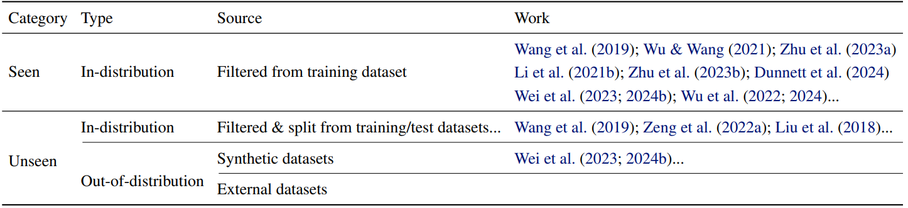

# BackdoorBenchER: Evaluating & Revisiting the Auxiliary Data in Backdoor Purification

[English](./README.md) | [简体中文](./asset/README_cn.md)

[Paper](https://arxiv.org/abs/2502.07231) | [Citation](#citation)

---

## 📢 Announcements

**Updated on 2025-02-12**: Initial release now available. Supports evaluation of backdoor purification on auxiliary datasets categorized as Seen (Train), Reserved (Split), and OOD (Transformations).

---

## 📝 Introduction

Welcome to the official repository for the paper "Revisiting the Auxiliary Data in Backdoor Purification". This project aims to establish a framework for evaluating backdoor purification techniques under practical conditions using diverse auxiliary datasets, moving beyond the assumption of idealized, in-distribution data.

---

## 📊 Project Overview

Backdoor attacks exploit vulnerabilities during model training to induce specific behaviors when triggered. To counteract these threats, backdoor purification techniques are employed, often relying on a small clean dataset known as auxiliary data. Despite advancements, the impact of auxiliary data characteristics on purification efficacy remains understudied. This project investigates how different types of auxiliary datasets—ranging from in-distribution to synthetic or externally sourced—affect purification outcomes, providing insights crucial for selecting or constructing effective defense mechanisms.



---

## 🛠️ Getting Started

Follow these steps to set up the project:

1. **Clone Repository**
    ```bash
    git clone https://github.com/shawkui/BackdoorBenchER.git
    cd BackdoorBenchER
    ```

2. **Install Dependencies**
    ```bash
    bash sh/install.sh
    ```

3. **Initialize Folders**
    ```bash
    bash sh/init_folders.sh
    ```

---

## ⚙️ Usage Instructions

### 🧪 Creating Auxiliary Datasets

For example, with CIFAR-10:

1. Download the dataset into `/data`.
2. Split it:
    ```bash
    python dataset/generate_split.py --dataset cifar10 --split_ratio 0.05 --random_seed 0
    ```
3. Generate OOD auxiliary data:
    ```bash
    python dataset/generate_ood.py --dataset cifar10_split_5_seed_0 --ood_type brightness
    ```
4. Create a CIFAR-10-like dataset from ImageNet:
    ```bash
    bash sh/cinic_download.sh
    python dataset/generate_cifar10_from_imagenet.py --dataset cifar10_split_5_seed_0 --ood_type imagenet
    ```


### 🛡️  Performing Attacks & Defenses
Simulate an attack:
```bash
python attack/badnet.py --save_folder_name badnet_demo --dataset cifar10_split_5_seed_0
```
Apply a defense:
```bash
python defense/ft.py --result_file badnet_demo --dataset cifar10_split_5_seed_0 --reserved_type reserved 
```

Customize configurations for all methods by editing `sh/config_edit.py`.

### 📄 Managing Results
All defense results are saved according to configurations specified in the `--yaml_path` argument.

For example, 

```bash
python defense/ft.py --result_file badnet_demo --dataset cifar10_split_5_seed_0 --reserved_type reserved --yaml_path ./config/defense/ft/demo.yaml
```
will save the results in ```record/badnet_demo/defense/ft/demo/ ```

---


## 📋 TODO

📅 **Upcoming Features:**

1. **Release Code for Generating Synthetic Data**: We will soon provide code to generate synthetic auxiliary datasets, expanding the variety of datasets available for testing and evaluation.
   
2. **Release Dataset**: In addition to the code, we plan to release a curated dataset specifically designed for backdoor purification research.

Stay tuned for updates!

---


## 📄 Citation

Please cite our work if used in your research:
```bibtex
@misc{wei2025revisitingauxiliarydatabackdoor,
      title={Revisiting the Auxiliary Data in Backdoor Purification}, 
      author={Shaokui Wei and Shanchao Yang and Jiayin Liu and Hongyuan Zha},
      year={2025},
      eprint={2502.07231},
      archivePrefix={arXiv},
      primaryClass={cs.CR},
      url={https://arxiv.org/abs/2502.07231}, 
}
```

---

## 🎖️ Acknowledgments

Our work builds upon [BackdoorBench](https://github.com/SCLBD/BackdoorBench). Consider giving them a star if their work is useful to you.

Our work is built upon previous works, including but not limited to:

* https://github.com/SCLBD/BackdoorBench
* https://github.com/AISafety-HKUST/Backdoor_Safety_Tuning
* https://github.com/BayesWatch/cinic-10
* https://github.com/shawkui/Shared_Adversarial_Unlearning

---

## 📞 Contact

For inquiries or feedback, open an issue or email `shaokuiwei@link.cuhk.edu.cn`.


